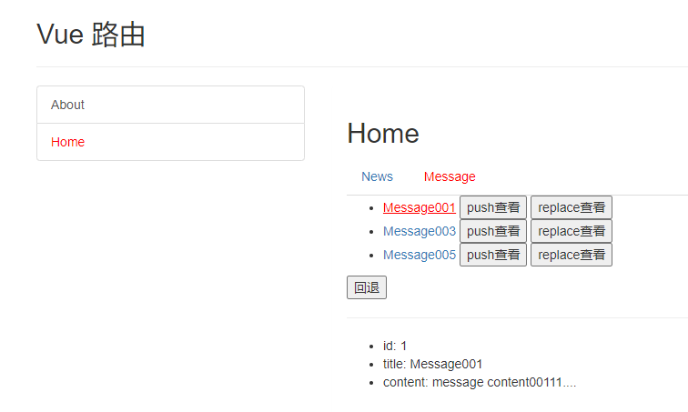

# vue-router

> A Vue.js project



## Build Setup

``` bash
# install dependencies
npm install

# serve with hot reload at localhost:8080
npm run dev

# build for production with minification
npm run build

# build for production and view the bundle analyzer report
npm run build --report
```

##  vue-router
    vue用来实现SPA的插件
    使用vue-router
        1. 创建路由器: router/index.js
          new VueRouter({
            routes: [
              { // 一般路由
                path: '/about',
                component: about
              },
              { // 自动跳转路由
                path: '/', 
                redirect: '/about'
              }
            ]
          })
        2. 注册路由器: main.js
           import router from './router'
           	new Vue({
           		router
           	})
        3. 使用路由组件标签:
           	<router-link to="/xxx">Go to XXX</router-link>
           	<router-view></router-view>
    编写路由的3步
        1. 定义路由组件    
        2. 映射路由
        3. 编写路由2个标签
    嵌套路由
        children: [
            {
              path: '/home/news',
              component: news
            },
            {
              path: 'message',
              component: message
            }
         ]
    向路由组件传递数据
        params: <router-link to="/home/news/abc/123">
        props: <router-view msg='abc'>
    缓存路由组件
        <keep-alive>
          <router-view></router-view>
        </keep-alive>
    路由的编程式导航
    	this.$router.push(path): 相当于点击路由链接(可以返回到当前路由界面)
    	this.$router.replace(path): 用新路由替换当前路由(不可以返回到当前路由界面)
    	this.$router.back(): 请求(返回)上一个记录路由